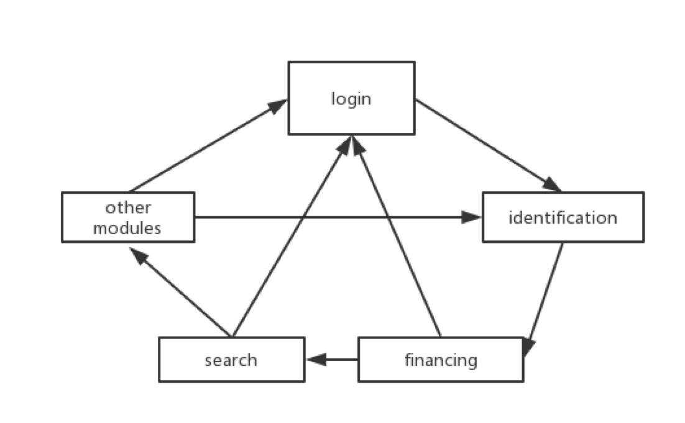
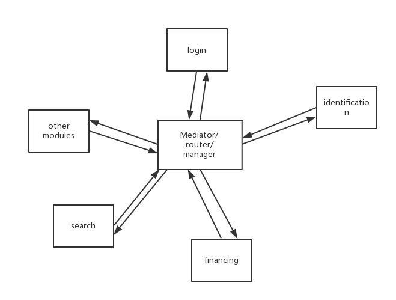
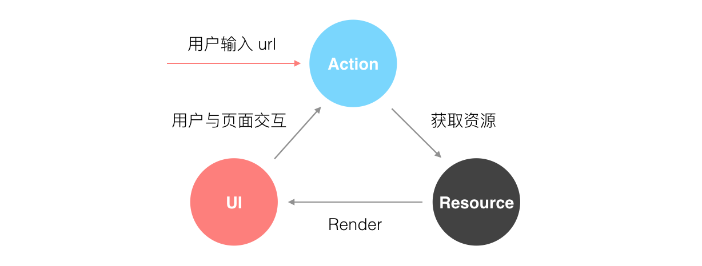
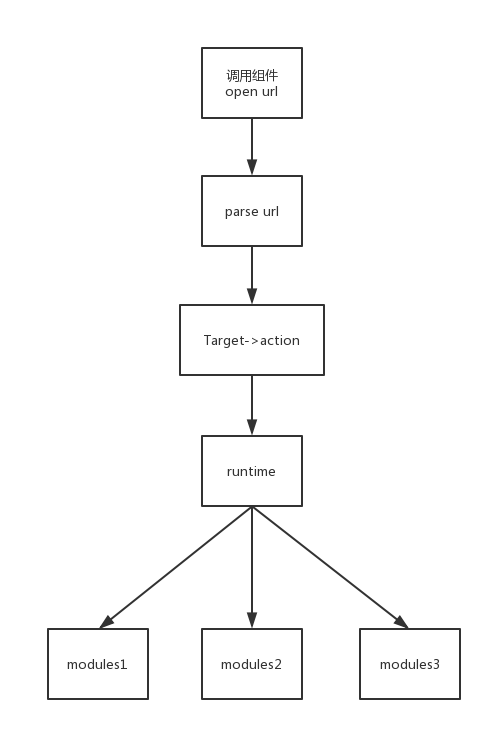
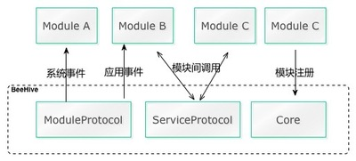

### 1. 问题：  
近两年随着软件业务的复杂程度不断提高，运营推广业务不断加快，加上ReactNative，Weex等技术的推动下，客户端开发已经不是简单的tab-navigation-mvc(mvvm)架构了. 

1. 软件业务迭代，版本更新频繁，APP代码重构与堆积的选择问题；  
2. 运营推广需求加大，APP更新速度问题；  
3. 新技术创新校验问题；
4. 开发团队不断壮大，开发者之间的沟通成本，以及互相之间的影响

### 2. 组件化（也可以说模块化）思路:  

组件化来源于大前端的迅猛发展，近年来的SPA（single page applicaton 单叶应用）, 以（VUE，  React）为代表。

组件化对于问题的解决：  

对于问题1:   
每个业务独立在各自的组件中，维护的思路从整个APP迁移到组件，组件重构总比整个APP重构轻松的多吧。  
对于问题2:  
运营推广是APP重要引流，大部分都是消息(push message),广告(ad)推广，相对于这些大多的做法是推送组件(push sdk)，路由组件(router 后面会详细讲)来解决  
对于问题3:  
新技术创新是团队必备，特别react-natvie的强势，APP中其中一个组件来调研一下是很必要的。
对于问题4:  
不同的开发者维护不同的组件，需要留下设计文档（用户后续开发者维护），开放接口文档&版本控制，其他开发者，不需要知道具体实现，只需要知道功能实现即可

### 3. 第一个组件

实现一个登录组件，提供登录页面, 注册页面接口

```Objc

+ (PPSLoginViewController *)loginView {
 PPSLoginViewController *loginVC = [[PPSLoginViewController alloc] init];
 return loginVC;
}

+ (PPSRegisterViewController *)registerView {
 PPSRegisterViewController *registerVC = [[PPSRegisterViewController alloc] init];
 return registerVC;
}
@end

```

看起来挺好，这样做简单明了，没有多余的东西，项目初期推荐这样快速开发，但到了项目越来越庞大，这种方式会有什么问题呢？显而易见，每个模块都离不开其他模块，互相依赖粘在一起成为一坨：



### 4. 组件化解耦

“高内聚，低耦合”，功能内聚不必多说，组件之间的耦合是组件化成功的关键，
向上面那样揉成一坨对测试/编译/开发效率/后续扩展都有一些坏处，那怎么解开这一坨呢。很简单，按软件工程的思路，下意识就会加一个中间层：


这样设计思路更符合，人脑审美但这里有几个问题：

1. Mediator 怎么去转发组件间调用？  
2. 一个模块只跟 Mediator 通信，怎么知道另一个模块提供了什么接口？  
3. 按上图的画法，模块和 Mediator 间互相依赖，怎样破除这个依赖？  


#### 4.1 方案1 （runtime + categroy）

```Objc
@implementation Mediator(Login)
+ (UIViewController *)login_ViewController {
 Class cls = NSClassFromString(@"LoginViewController");
 return [[cls alloc] init];
}
+ (UIViewController *)register_viewController {
 Class cls = NSClassFromString(@"RegisterViewController");
 return [[cls alloc] init];
}
@end
```

每个组件的接口，通过category的方式写在Mediator, 每个方法通过runtime的方式解耦

#### 4.2 方案2 （router）

router思路来源于SPA单页面应用，路由起到了很关键的作用。路由的作用主要是保证视图和 URL 的同步。在前端的眼里看来，视图是被看成是资源的一种表现



开发router方案有很多, 思路基本一致  URL -> block

[JLRoutes](https://github.com/joeldev/JLRoutes)  
[HHRouter](https://github.com/lightory/HHRouter)   
[MGJRouter](https://github.com/mogujie/MGJRouter)   

用法基本相同, 以MGJRouter为例 

```Objc
//注册路由
[MGJRouter registerURLPattern:@"mgj://foo/bar" toHandler:^(NSDictionary *routerParameters) {
    NSLog(@"routerParameterUserInfo:%@", routerParameters[MGJRouterParameterUserInfo]);
}];

//调用路由
[MGJRouter openURL:@"mgj://foo/bar"];
```

针对以上方案业界提出3个问题：

1. 需要有个地方列出各个组件里有什么 URL 接口可供调用。蘑菇街做了个后台专门管理。  
2. 每个组件都需要初始化，内存里需要保存一份表，组件多了会有内存问题。  
3. 参数的格式不明确，是个灵活的 dictionary，也需要有个地方可以查参数格式。    

第二点没法解决，第一点和第三点可以跟前面那个方案一样，在 Mediator 每个组件暴露方法的转接口，然后使用起来就跟前面那种方式一样了。

抛开URL不说，这种方案跟方案1的共同思路就是：Mediator 不能直接去调用组件的方法，因为这样会产生依赖，那我就要通过其他方法去调用，也就是通过 字符串->方法 的映射去调用。runtime 接口的 className + selectorName -> IMP 是一种，注册表的 key -> block 是一种，而前一种是 OC 自带的特性，后一种需要内存维持一份注册表，这是不必要的。

#### 4.3 方案3 [这部分来源于 bang对于router和target-class方案的总结[iOS 组件化方案探索](http://blog.cnbang.net/tech/3080/)]

蘑菇街为了补全本地调用的功能，为组件多加了另一种方案，就是通过 protocol-class 注册表的方式。首先有一个新的中间件：

```Objc

@implementation ProtocolMediator
@property (nonatomic, storng) NSMutableDictionary *protocolCache
- (void)registerProtocol:(Protocol *)proto forClass:(Class)cls {
 NSMutableDictionary *protocolCache;
 [protocolCache setObject:cls forKey:NSStringFromProtocol(proto)];
}

- (Class)classForProtocol:(Protocol *)proto {
 return protocolCache[NSStringFromProtocol(proto)];
}
@end

```

内存中保存了protocolCache 一份protocol to class的注册表

然后有一个公共Protocol文件，定义了每一个组件对外提供的接口：

```Objc
//ComponentProtocol.h
@protocol BookDetailComponentProtocol <NSObject>
- (UIViewController *)bookDetailController:(NSString *)bookId;
- (UIImage *)coverImageWithBookId:(NSString *)bookId;
@end

@protocol ReviewComponentProtocol <NSObject>
- (UIViewController *)ReviewController:(NSString *)bookId;
@end
```

再在模块里实现这些接口，并在初始化时调用 registerProtocol 注册。

```Objc

/BookDetailComponent 组件
#import "ProtocolMediator.h"
#import "ComponentProtocol.h"
#import "WRBookDetailViewController.h"
+ (void)initComponent
{
 [[ProtocolMediator sharedInstance] registerProtocol:@protocol(BookDetailComponentProtocol) forClass:[self class];
}

- (UIViewController *)bookDetailController:(NSString *)bookId {
 WRBookDetailViewController *detailVC = [[WRBookDetailViewController alloc] initWithBookId:param[@"bookId"]];
 return detailVC;
}

- (UIImage *)coverImageWithBookId:(NSString *)bookId {
 ….
}

```

最后调用者通过 protocol 从 ProtocolMediator 拿到提供这些方法的 Class，再进行调用：

```
//WRReadingViewController.m 调用者
//ReadingViewController.m
#import "ProtocolMediator.h"
#import "ComponentProtocol.h"
+ (void)gotoDetail:(NSString *)bookId {
 Class cls = [[ProtocolMediator sharedInstance] classForProtocol:BookDetailComponentProtocol];
 id bookDetailComponent = [[cls alloc] init];
 UIViewController *vc = [bookDetailComponent bookDetailController:bookId];
 [[UIApplication sharedApplication].keyWindow.rootViewController.navigationController pushViewController:vc animated:YES];
}

```

#### 4.4 方案4

target-class 



该方案由方案1 优化而来
这个方案特点：
1. URL并不需要注册，而是直接解析URL并生产对应Target - action.       
2. 充分利用iOS runtime机制，生成class - selector直接调用各个模块中的category.   
3. 区分出了URL的本地调用&远程调用规则.   
* 远程调用走远程调用路径，也就是openUrl->urlParse->perform->target-action。  
* 本地组件间调用就走本地组件间调用路径：perform->target-action 


对于此方案也有很多持有反对, 尤其是"去model化".    

去model化：组件之间的参数传递，多以NSDictionary传递，我对于Casa所提的”去Model化“始终存疑，我仔细读过其博客关于“去model化”的解释，也拜读了Martin Fowler反对Anemic Domain Model的文章，Martin Fowler并没有反对使用model，而是提倡让model去承担更多的domain logic。就我个人写代码体验而言，使用model来描述数据比dictionary更清晰直观，这里使用显示的函数入参声明也更直观。第三方库在提供接口的时候也鲜少有以Dictionary作为入参的。


#### 4.5 方案5: [阿里蜂窝](https://github.com/alibaba/BeeHive/blob/master/README-CN.md)

* 思路来源

因为基于Spring的Service理念，虽然可以使模块间的具体实现与接口解耦，但无法避免对接口类的依赖关系。  

为什么不使用invoke以及动态链接库技术实现对接口实现的解耦，类似Apache的DSO的方式？   

主要是考虑学习成本难度以及动态调用实现无法在编译检查阶段检测接口参数变更等问题，动态技术需要更高的编程门槛要求。   

* 项目名来源

BeeHive灵感来源于蜂窝。蜂窝是世界上高度模块化的工程结构，六边形的设计能带来无限扩张的可能。所以我们用了BeeHive来做为这个项目的命名。

* 基本架构



* 特点

协议注册： 面向统一注册接口，在多人协作上有很大的好处，来自不同开发者思路不同，开放的接口也不尽相同，抽象协议可以做大最大化统一.    

protocol-class: 这一点与方案3类似.  

集成系统事件：每个组件可以通过协议实现系统事件。  

组件动态&静态注册。  


### 5 总结


关于组件化，一切都是基于业务，无业务就没有框架，组件就没有任何意义。
上面到底哪个更好，还要根据一些具体实际情况，比如版本迭代频率，开发组人员结构，运营要求等等...   

创新不会停止，这些方案可能在我写完这篇文章那一刻就已经out of time，从这些方案找到符合实际业务的思路，积极采纳新思路，探索新领域，才能让框架思想更完善


